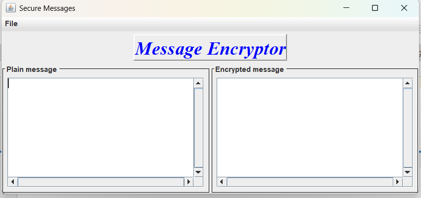
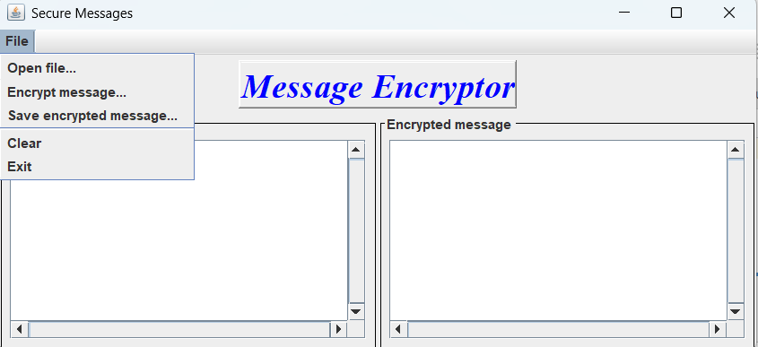
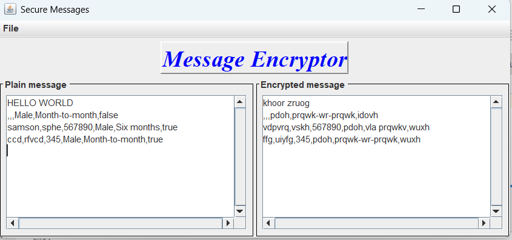

# 🔐 Secure Messages - Java Message Encryptor

A desktop Java Swing application that allows users to open a text file, encrypt its contents, display both the original and encrypted messages, and save the encrypted message into an Apache Derby database.

## 📸 Screenshots

### Main Window


### File Menu


### Encryption Result


> Place your screenshots inside a folder named **screenshots** and update the filenames if necessary.

---

## 📖 Project Overview

This project demonstrates:

- Java Swing GUI development
- File handling in Java
- Event-driven programming
- Object-Oriented Programming (OOP)
- Text encryption using a custom encryption class
- Database connectivity using JDBC
- Saving encrypted messages into an Apache Derby database

The application reads plain text from a file, encrypts it using a custom encryption algorithm, displays both versions side-by-side, and stores the encrypted message in a database.

---

## ✨ Features

- 📂 Open text files
- 🔒 Encrypt messages
- 📝 Display plain and encrypted text
- 💾 Save encrypted messages to an Apache Derby database
- 🧹 Clear both text areas
- ❌ Exit application

---

## 🛠 Technologies Used

- Java
- Java Swing
- JDBC
- Apache Derby Database
- NetBeans IDE

---

## 📁 Project Structure

```
SecureMessages/
│
├── SecureMessagesApp/
│   ├── src/
│   │   └── securemessagesapp/
│   │       └── SecureMessagesApp.java
│   ├── lib/
│   │   ├── secureMessagesFrameLibrary.jar
│   │   ├── derby.jar
│   │   ├── derbyclient.jar
│   │   ├── derbynet.jar
│   ├── test/
│   │   └── (optional unit tests)
│   ├── screenshots/
│   ├── main.png
│   ├── menu.png
│   └── encryption.png
│   
│
├── secureMessagesFrameLibrary/
│   ├── src/
│   │   ├── za/ac/tut/encryption/
│   │   │   └── MessageEncryptor.java
│   │   ├── za/ac/tut/message/
│   │   │   └── Message.java
│   │   └── za/ac/tut/ui/
│   │       └── SecureMessagesFrame.java
│   ├── test/
│   └── (optional unit tests)

```

---

## 🚀 How It Works

### 1. Open File

Select **File → Open file...**

Choose a text (.txt) file containing your message.

The contents are displayed in the **Plain Message** panel.

---

### 2. Encrypt Message

Select **File → Encrypt message...**

The application creates a `Message` object and passes it to the `MessageEncryptor` class.

The encrypted message is displayed in the **Encrypted Message** panel.

---

### 3. Save Encrypted Message

Select **File → Save encrypted message...**

The encrypted text is saved into the Derby database using JDBC.

Example SQL statement:

```sql
INSERT INTO Messages(encrypted_text, timestamp)
VALUES (?, CURRENT_TIMESTAMP);
```

---

### 4. Clear

Removes all text from both message panels.

---

### 5. Exit

Closes the application.

---

## 🗄 Database

Database:

```
Message
```

Table:

```
Messages
```

Example schema:

```sql
CREATE TABLE Messages (
    id INT GENERATED ALWAYS AS IDENTITY PRIMARY KEY,
    encrypted_text VARCHAR(5000),
    timestamp TIMESTAMP
);
```

---

## ▶ Running the Project

### Requirements

- Java JDK 8+
- NetBeans IDE (recommended)
- Apache Derby Database

Clone the repository:

```bash
git clone https://github.com/yourusername/SecureMessages.git
```

Open the project in NetBeans and run:

```
SecureMessagesApp.java
```

---

## 📚 Concepts Demonstrated

- Java Swing
- Object-Oriented Programming
- File Input
- Event Handling
- JDBC Database Connectivity
- Exception Handling
- GUI Design
- MVC Principles

---

## 👨‍💻 Author

**Samson Sphephile Gumede**
